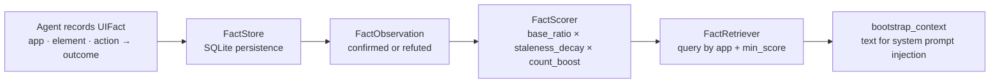

# clickproof

**Persistent GUI behavioral facts for computer-use agents.**


[](https://github.com/sandeep-alluru/clickproof/actions/workflows/ci.yml)
[](https://pypi.org/project/clickproof/)
[](https://pypi.org/project/clickproof/)
[](https://pypi.org/project/clickproof/)
[](LICENSE)
[](https://codecov.io/gh/sandeep-alluru/clickproof)
[](https://mypy-lang.org/)

[Quick Start](#quick-start) · [How It Works](#how-it-works) · [CLI Reference](#cli-reference) · [GitHub Action](#github-action) · [vs. Alternatives](#vs-alternatives) · [Claude/MCP](#claudemcp) · [Contributing](CONTRIBUTING.md)

---

## Why

Computer-use agents navigate GUIs blindly. Every session restarts from zero — the agent re-discovers which button opens a dialog, which tab holds exports, which field triggers validation.

This is expensive. More importantly, it's fragile: apps change, and the agent's cached intuition from training is often wrong.

**clickproof** solves this by giving agents a persistent, confidence-scored memory of UI behavioral facts. Before a session starts, the agent loads what is known about the target app. Observations from every run update confidence scores. When an interface changes, scores decay and the agent adapts.

```bash
# Inject known facts into an agent's system prompt
clickproof query salesforce --min-score 0.7
```

---

## How It Works



**Core primitives:**

- **UIFact** — an immutable, content-addressed record of `app_name + app_version + element + action → outcome`. ID = SHA-256[:16] of the key fields. Same element observed twice always produces the same ID.
- **FactObservation** — a confirmed/refuted signal from an agent run, linked to a UIFact.
- **FactScorer** — computes a confidence score from observation history: `base_ratio × staleness_decay × count_boost`.
- **FactRetriever** — queries facts by app and version, filtered by minimum score, and generates a text context string for agent injection.

---

## Features

| Feature | Details |
|---------|---------|
| Content-addressed facts | Same app/version/element/action always produces the same ID |
| Bayesian-style scoring | Score = base ratio × staleness decay × count boost |
| Staleness decay | Score decays exponentially at e^(-0.1 × staleness_days) |
| Offline / local-first | Single SQLite file, no server required |
| Agent context injection | `bootstrap_context()` returns a ready-to-inject text block |
| JSON output | Machine-readable output for downstream automation |
| Markdown output | Ready-to-paste format for issue comments and PRs |
| FastAPI REST server | `/fact`, `/observe`, `/query`, `/facts`, `/bootstrap`, `/health` endpoints |
| MCP server | Model Context Protocol tools for Claude and other MCP-compatible agents |
| 109 tests | Comprehensive suite covering all layers with 87%+ branch coverage |

---

## Quick Start

```bash
pip install clickproof
```

```python
from clickproof import UIFact, FactObservation, FactStore, FactRetriever, FactScorer
import time

with FactStore("my_app.db") as store:
    # Record a UI behavioral fact
    fact = UIFact(
        app_name="salesforce",
        app_version="2025.11",
        element="export-csv-button",
        action="click",
        outcome="opens-download-dialog",
        context="reports-page",
    )
    store.add_fact(fact)

    # Record an observation confirming the fact
    obs = FactObservation(
        fact_id=fact.id,
        observed_at=time.time(),
        confirmed=True,
        agent_run_id="run_001",
    )
    store.add_observation(obs)

    # Retrieve facts for an app session
    retriever = FactRetriever(store, FactScorer())
    pairs = retriever.query(app_name="salesforce", min_score=0.5)
    for fact, score in pairs:
        print(f"[{score.score:.2f}] {fact.element} --{fact.action}--> {fact.outcome}")

    # Get a text block for agent context injection
    context = retriever.bootstrap_context("salesforce", "2025.11")
    print(context)
```

---

## CLI Reference

```
clickproof [--db PATH] COMMAND [ARGS]

Commands:
  add     APP VERSION ELEMENT ACTION OUTCOME  Stage a UIFact
  observe FACT_ID --confirmed/--refuted       Record an observation
  query   APP [--version V] [--min-score F]   Retrieve scored facts
  log     [--app APP] [--json]                List all stored facts
  status                                      Show store info and stats
```

### Examples

```bash
# Add a fact
clickproof add salesforce 2025.11 export-csv-button click opens-download-dialog

# Confirm it from an agent run
clickproof observe <fact_id> --confirmed --run-id run_001

# Query with minimum score threshold
clickproof query salesforce --min-score 0.6

# Get JSON output for scripting
clickproof query salesforce --json | jq '.facts[].fact.element'

# Show store info
clickproof status
```

---

## GitHub Action

Add clickproof fact queries to any CI/CD workflow:

```yaml
- uses: sandeep-alluru/clickproof@main
  with:
    app-name: salesforce
    app-version: "2025.11"
    db: clickproof.db
    min-score: "0.5"
```

---

## vs. Alternatives

| | clickproof | Plain cache | Vector store | Re-run |
|---|---|---|---|---|
| Confidence-based | ✓ | ✗ | partial | ✗ |
| Staleness decay | ✓ | ✗ | ✗ | N/A |
| Content-addressed | ✓ | ✗ | ✗ | N/A |
| Local-first | ✓ | ✓ | partial | ✓ |
| MCP native | ✓ | ✗ | partial | ✗ |
| Agent context injection | ✓ | manual | manual | N/A |

---

## Claude/MCP

clickproof ships a built-in MCP server. Add it to your Claude configuration:

```json
{
  "mcpServers": {
    "clickproof": {
      "command": "clickproof-mcp",
      "env": { "CLICKPROOF_DB": "/path/to/clickproof.db" }
    }
  }
}
```

Available MCP tools: `add_ui_fact`, `query_facts`, `bootstrap_context`.

---

## OpenAI / Tool Use

See `tools/openai-tools.json` for pre-built OpenAI function-calling tool definitions.

---

## Repository Tree

```
clickproof/
├── clickproof/
│   ├── __init__.py        Public API
│   ├── fact.py            UIFact + FactObservation data models
│   ├── scorer.py          FactScorer + FactScore
│   ├── store.py           SQLite-backed FactStore
│   ├── retriever.py       FactRetriever + bootstrap_context
│   ├── report.py          Rich / JSON / Markdown formatters
│   ├── cli.py             Click CLI
│   ├── api.py             FastAPI server
│   └── mcp_server.py      MCP server
├── tests/                 45+ pytest tests
├── examples/demo.py       Standalone walkthrough
├── action.yml             GitHub Action
└── pyproject.toml
```

---

## GitHub Topics

`computer-use` `llm-agents` `agent-memory` `gui-automation` `behavioral-facts` `mcp` `llmops` `sqlite` `python`

---

## Star History

[](https://star-history.com/#sandeep-alluru/clickproof&Date)
